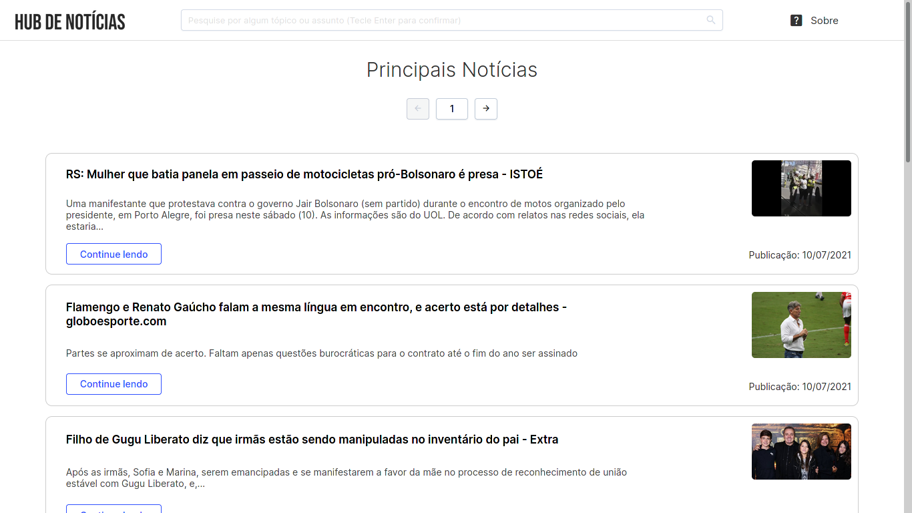
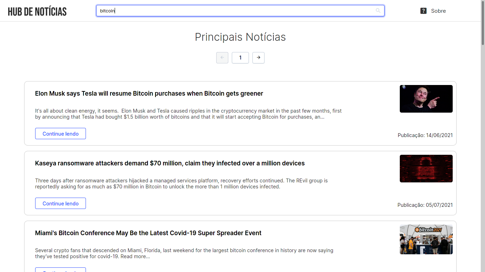
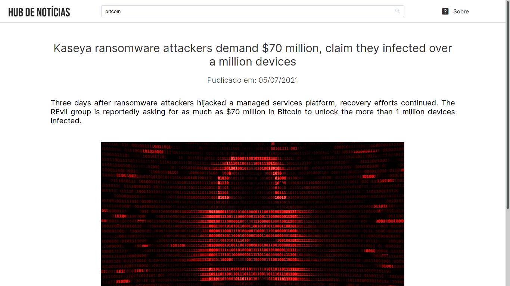

# News Hub

Projeto para listagem de notícias (vindo da News API) e uso de Vue 3 com Typescript.





## Tecnologias usadas

- Vue 3
- Sass (SCSS)
- Equal (Framework UI)
- News API

## Requerimentos

Para teste da aplicação é necessário que os seguintes programas estejam instalados:

- Node JS
- Yarn
- Vue CLI

### Configuração do Projeto
```
yarn install
```

### Servidor local para teste
```
yarn serve
```

## News API

Esse projeto utiliza como base a News API para consumo dos dados, para seu correto funcionamento é necessário a criação de um arquivo ```env``` com as credenciais da API (existe um arquivo ```env.example``` demonstrando os campos necessários).

Vale ressaltar que o uso gratuito da API não permite a hospedagem do serviço. Caso tenha esse interesse, é necessário atualizar para o plano pago, conforme os [termos de uso](https://newsapi.org/pricing) do serviço.

